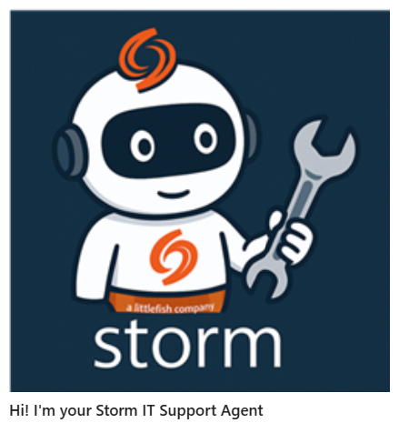

# Storm IT Support Agent - Project Overview

---

## Executive Summary

We are developing an AI-powered support agent for Microsoft Teams that integrates with our Dynamics 365 environment to provide instant, 24/7 support to our staff. The agent uses natural language processing to understand issues, search our knowledge base, and create support cases when needed.

**Current Status:** ✅ **Proof of Concept Working** - Phase 1 Complete (~45% of full project)

---

## What the Agent Does

### 🤖 Intelligent Conversation
The agent engages users in natural conversation to understand their support needs:
- Greets users and asks about their issue
- Identifies which system is affected (CRM, Sharepoint  IT Infrastructure, Software, etc.)
- Determines issue priority (High, Medium, Low)
- Guides users to the right solution

### 🔍 Knowledge Base Search
The agent searches our Dynamics 365 Knowledge Base in real-time:
- Finds relevant articles based on the user's issue description
- Returns formatted results with clickable links to D365 articles
- Handles multiple scenarios:
  - No articles found → Offers to create support case
  - Articles found → Presents them and asks if issue is resolved

### 📋 Support Case Management *(Coming Next)*
The agent will create and manage support cases in D365:
- Creates detailed support cases with all collected information
- Tracks case status and updates
- Retrieves case details including latest portal comments
- Provides case reporting and queries

### 📊 Reporting & Analytics *(Coming Next)*
The agent will answer questions about support cases:
- "How many cases are currently open?"
- "Show me cases assigned to [person]"
- "What's the status of my cases?"

---

## Key Features

### ✅ Currently Working
- ✅ Natural language conversation with staff
- ✅ Intelligent issue triage and classification
- ✅ Real-time D365 Knowledge Base search
- ✅ Formatted article results with direct links
- ✅ Smart routing based on whether solutions are found
- ✅ Custom entities for system types, priorities, and case numbers
- ✅ Professional, branded interface with Storm logo

### 🚧 In Development (Next Phase)
- 🚧 Support case creation in D365
- 🚧 Case status checking and updates
- 🚧 Case reporting and queries
- 🚧 Deployment to Microsoft Teams
- 🚧 Organization-wide rollout

---

## Business Benefits

### 🚀 Immediate Impact
- **24/7 Availability**: Staff can get help anytime, reducing wait times
- **Faster Resolution**: Knowledge base articles provide instant solutions
- **Reduced Ticket Volume**: Self-service resolves issues before they become tickets
- **Consistent Experience**: Every user gets the same quality support

### 💰 Cost Savings
- **Reduced Support Workload**: Routine questions handled automatically
- **Efficient Ticket Creation**: All necessary information collected upfront
- **Better Resource Allocation**: Support team focuses on complex issues
- **Knowledge Base Utilization**: Existing documentation is actively used

### 📈 Long-term Value
- **Scalable Support**: Handles unlimited concurrent users
- **Data-Driven Insights**: Analytics on common issues and resolution rates
- **Continuous Improvement**: AI learns and improves over time
- **Employee Satisfaction**: Quick, easy access to support

---

## Technical Architecture

### Platform Stack
- **Frontend**: Microsoft Teams (native integration)
- **AI Engine**: Microsoft Copilot Studio (Generative AI)
- **Business Logic**: Power Automate (flows connecting to D365)
- **Data Source**: Dynamics 365 (Knowledge Base, Cases, Portal Comments)

### Integration Points
- ✅ D365 Dataverse API (Knowledge Articles)
- 🚧 D365 Case Management
- 🚧 D365 Portal Comments (adx_portalcomment)
- 🚧 Microsoft Teams (deployment)

### Security & Compliance
- ✅ Azure AD authentication (via Teams)
- ✅ D365 security roles enforced
- ✅ User context preserved (cases created with correct user identity)
- ✅ Data stays within Microsoft 365 tenant

---

## Current Capabilities Demo

### Example Conversation Flow

**User:** "I need help"

**Agent:** "Hi! I'm your Storm IT Support Agent. I'm here to help you resolve issues quickly. What can I help you with today?"

**User:** "I can't login to CRM"

**Agent:** "Which system or area is this related to?"

**User:** "CRM"

**Agent:** "How urgent is this issue?"

**User:** "High"

**Agent:** "Got it. Would you like me to:
1. Search our knowledge base for a solution
2. Create a support case right away"

**User:** "Search for solution"

**Agent:** *(Searches D365 Knowledge Base in real-time)*

"✅ I found 2 knowledge base article(s) that might help!

📄 **How to Reset CRM Password**
   Article #: KA-01030
   🔗 https://stormtechnology2.crm4.dynamics.com/main.aspx?pagetype=entityrecord&etn=knowledgearticle&id=...

📄 **CRM Login Troubleshooting Guide**
   Article #: KA-01045
   🔗 https://stormtechnology2.crm4.dynamics.com/main.aspx?pagetype=entityrecord&etn=knowledgearticle&id=...

Did this information help resolve your issue?"

**User:** "Yes"

**Agent:** "Great! I'm glad I could help."

---

## Implementation Progress

### Phase 1: Foundation ✅ (Complete)
- ✅ Copilot Studio agent created and configured
- ✅ Custom entities for issue classification
- ✅ Greeting and triage conversation flow
- ✅ Knowledge base search flow (Power Automate)
- ✅ D365 integration working
- ✅ Conditional logic for result handling
- ✅ Professional branding and messaging

**Time Invested:** ~6-8 hours
**Status:** Working proof of concept

### Phase 2: Core Features 🚧 (Next - Est. 4-6 hours)
- 🚧 Create support case flow
- 🚧 Check case status flow
- 🚧 Query cases flow
- 🚧 Connect all flows to conversation topics
- 🚧 End-to-end testing

**Timeline:** 1-2 weeks

### Phase 3: Deployment & Rollout 📅 (Planned)
- 📅 Deploy to Microsoft Teams
- 📅 Pilot with 10-20 users
- 📅 Gather feedback and iterate
- 📅 Organization-wide rollout
- 📅 User training and documentation

**Timeline:** 2-3 weeks after Phase 2

---

## Success Metrics

### Phase 1 Metrics (Current)
- ✅ Agent responds in natural language
- ✅ Knowledge base search returns results in < 2 seconds
- ✅ Articles display with clickable links
- ✅ Handles 0, 1, or multiple article scenarios

### Phase 2 Target Metrics
- Support case creation success rate: 95%+
- Case information completeness: 100%
- Average conversation time: < 5 minutes
- Knowledge base resolution rate: 40%+

### Phase 3 Target Metrics (Post-Deployment)
- User adoption: 60% of staff in first month
- Ticket volume reduction: 25-30%
- Average resolution time: < 3 minutes
- User satisfaction: 4.0+ out of 5.0

---

## Resource Requirements

### Current Resources
- ✅ 1 Developer (implementation)
- ✅ Access to Copilot Studio, Power Automate, D365

### Additional Resources Needed
- Teams Admin (for deployment and org-wide settings)
- Support Team Lead (for knowledge base review and testing)
- 10-20 Pilot Users (for UAT phase)

### Licenses Required
- ✅ Copilot Studio (~$200/month for 1000 sessions)
- ✅ Power Automate Premium (~$15/user/month or $100/month unlimited)
- ✅ Dynamics 365 (existing)
- ✅ Microsoft Teams (existing via M365)

---

## Risks & Mitigations

| Risk | Impact | Mitigation |
|------|--------|------------|
| Knowledge base articles are outdated or incomplete | Medium | Review and update KB before Phase 3 rollout |
| User adoption is low | High | Training, communication, executive sponsorship |
| AI occasionally misunderstands user intent | Low | Continuous monitoring, feedback loop, improve prompts |
| D365 API rate limits during high usage | Low | Implement caching, optimize queries |

---

## Next Steps

### Immediate (Next 1-2 Weeks)
1. ✅ Complete Phase 2 development (3 remaining flows)
2. ✅ Connect all flows to conversation topics
3. ✅ End-to-end testing
4. ✅ Demo to leadership for approval

### Short-term (Weeks 3-4)
1. Deploy to Microsoft Teams
2. Pilot with 10-20 users
3. Gather feedback and iterate
4. Create user documentation

### Medium-term (Month 2)
1. Organization-wide rollout
2. User training sessions
3. Monitor analytics and adjust
4. Continuous improvement

---

## Demo & Questions

### Want to See It in Action?
The agent is currently testable in Copilot Studio. We can schedule a live demo to show:
- Natural conversation flow
- Real-time knowledge base search
- D365 integration
- Conditional logic and routing

### Questions?
Contact: [Your Name]
Email: [Your Email]
Demo Available: Yes - Contact to schedule

---

## Recommendations

### ✅ Approve to Proceed
We recommend approving Phase 2 development to complete the core features. The proof of concept demonstrates:
- Technical feasibility ✅
- D365 integration works ✅
- User experience is intuitive ✅
- Business value is clear ✅

**Investment Required:**
- Development time: 4-6 additional hours
- Timeline: 1-2 weeks
- Cost: Existing licenses (no additional cost)

**Expected ROI:**
- 25-30% reduction in support tickets
- Faster resolution times
- Improved employee satisfaction
- 24/7 support availability

### 📊 Success Criteria for Phase 2
Before moving to Phase 3 (deployment), we will ensure:
- All 4 flows working correctly
- Cases created successfully in D365
- Case status retrieval working
- Case reporting accurate
- End-to-end testing passed

---

## Appendix: Technical Details

### Conversation Topics Built
1. **Greeting and Issue Triage** - Collects issue details, system, priority
2. **Check Case Status** - Retrieves case information (placeholder, will be completed in Phase 2)

### Power Automate Flows Built
1. **Search Knowledge Base** - Queries D365 knowledgearticle entity, returns formatted results

### Custom Entities Created
1. **SystemModule** - CRM, Finance, HR, IT Infrastructure, Email, Other
2. **PriorityLevel** - High, Medium, Low
3. **CaseNumber** - Pattern matcher for case numbers (SR-XXXXX-XXXXX)

### D365 Entities Accessed
- ✅ knowledgearticle (Knowledge Base)
- 🚧 incident (Cases) - Next phase
- 🚧 adx_portalcomment (Portal Comments) - Next phase
- 🚧 systemuser (Users) - Next phase

---

**Document Version:** 1.0
**Date:** February 10, 2026
**Status:** Phase 1 Complete - Proof of Concept Working
**Next Review:** After Phase 2 completion

---

*Built with Microsoft Copilot Studio, Power Automate, and Dynamics 365*
